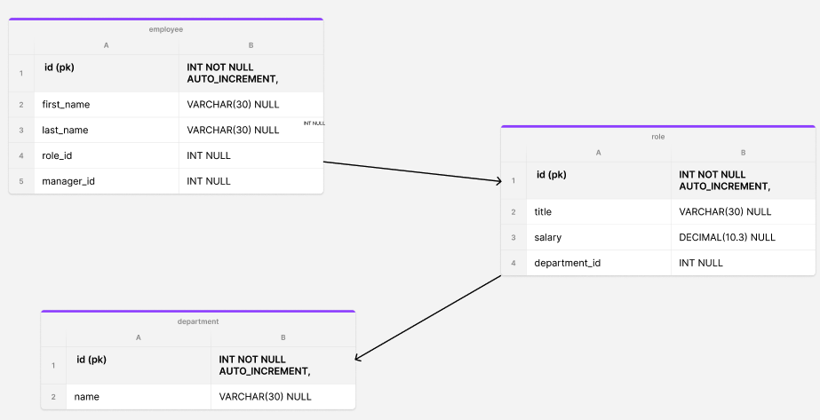
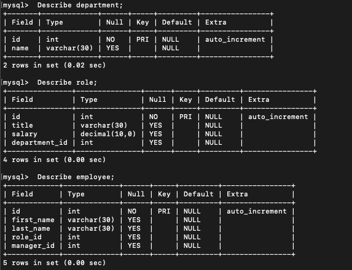

# Employee Tracker
Developers frequently have to create interfaces that allow non-developers to easily view and interact with information stored in databases. These interfaces are called content management systems (CMS). Your assignment this week is to build a command-line application from scratch to manage a company's employee database, using Node.js, Inquirer, and MySQL.
# Table-of-Contents
  * [Walk through Video](#walk-through-Video)
  * [Git Repo](#git-repo)
  * [Dependency](#dependency)
  * [User Story](#user-story)
  * [Acceptance Criteria](#acceptance-criteria)
  * [Application Invoked](#application-invoked)
  * [Database schema](#database-schema)
    * [Table Describe](#table-describe)

# [Walk through Video](#table-of-contents)
https://vimeo.com/753642221

# [Git Repo](#table-of-contents)
```
  https://github.com/kabirfaisal1/EmployeeTracker.git
```
# [Dependency](#table-of-contents)
  ## System
  ```
      node.js
  ```
  ## On project
  ```
      npm i inquirer@8.2.4 
  ```
  ```
      npm i mysql
  ```

# [User Story](#table-of-contents)
```
AS A business owner
I WANT to be able to view and manage the departments, roles, and employees in my company
SO THAT I can organize and plan my business
```

# [Acceptance Criteria](#table-of-contents)
```
GIVEN a command-line application that accepts user input
WHEN I start the application
THEN I am presented with the following options: view all departments, view all roles, view all employees, add a department, add a role, add an employee, and update an employee role
WHEN I choose to view all departments
THEN I am presented with a formatted table showing department names and department ids
WHEN I choose to view all roles
THEN I am presented with the job title, role id, the department that role belongs to, and the salary for that role
WHEN I choose to view all employees
THEN I am presented with a formatted table showing employee data, including employee ids, first names, last names, job titles, departments, salaries, and managers that the employees report to
WHEN I choose to add a department
THEN I am prompted to enter the name of the department and that department is added to the database
WHEN I choose to add a role
THEN I am prompted to enter the name, salary, and department for the role and that role is added to the database
WHEN I choose to add an employee
THEN I am prompted to enter the employee’s first name, last name, role, and manager, and that employee is added to the database
WHEN I choose to update an employee role
THEN I am prompted to select an employee to update and their new role and this information is updated in the database
```
## [Application Invoked](#table-of-contents)
1. create database and tables
```
    mysql -u root -p

      source <filePath>/schema.sql
```
2. insert data to database
```
  source <filePath>/seed.sql
```
3. run the app
```
 cd <projectFile> 
 node [your node app].js
```

# [Database schema](#table-of-contents)

## [Table Describe](#table-of-contents)


## Node and NPM Doc
https://nodejs.org/en/download/package-manager/
https://docs.npmjs.com/downloading-and-installing-node-js-and-npm
